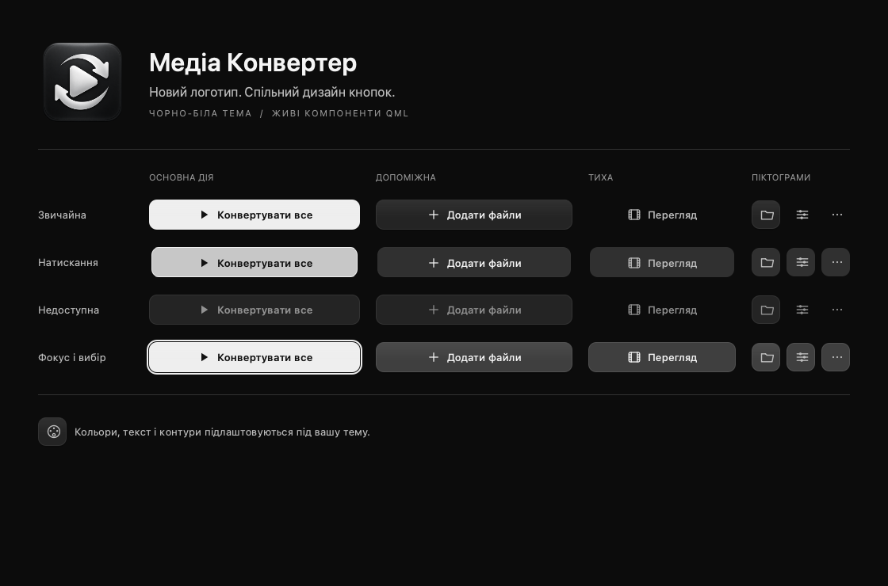
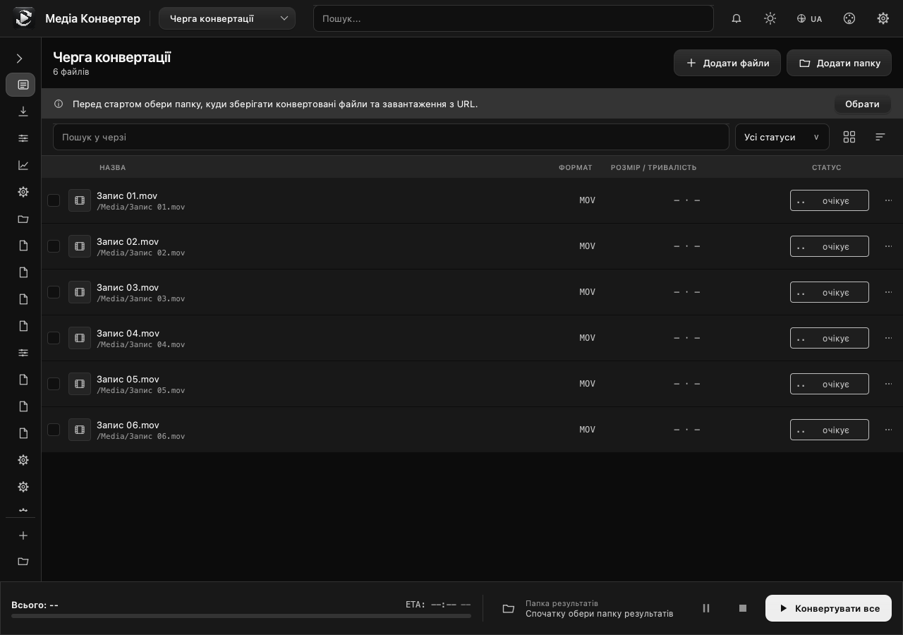

# Media Converter identity

The current logo is [`assets/app-logo-v2.png`](../assets/app-logo-v2.png): a 1254 × 1254 PNG with an alpha channel. It was generated with the built-in imagegen tool. The prior logo is retained as `assets/app-logo.png`.

The new asset is used by the application window, top bar, welcome popup, and theme preview. `BrandMark.qml` shares a cached 256 px texture with mipmaps for small displays. The Windows build generates `app-logo-v2.ico` from the same PNG in 16, 24, 32, 48, 64, 128, and 256 px sizes; this derived file is ignored by Git.

## Buttons

`AppButton.qml` and `ButtonSurface.qml` provide the shared design for primary, secondary, quiet, icon, and navigation buttons. The controls use 10 px corners, 38 px default height, optical icon/text alignment, a subtle surface highlight, 90–120 ms press/hover transitions, and a separate keyboard focus ring. Colors derive from the selected theme. Rendering uses QML rectangles and gradients without blur effects or offscreen textures for buttons.

`PrimaryButton`, `SecondaryButton`, and `GhostButton` preserve existing click handlers. Main actions use drawn icons with localizable text. Disabled controls keep readable labels and reject activation. Truncated button labels expose the complete text in a tooltip.

## Preview

These screenshots show the implemented QML controls and the running application:





## Generation prompt

```text
Use case: logo-brand.
Asset type: production application icon PNG for a desktop app named Media Converter, designed to read clearly from 24px to 1024px.
Primary request: an original premium black-and-white app logo inspired by Apple's restraint, precision and macOS icon craftsmanship.
Subject: one bold, very simple white/silver symbol combining a right-facing rounded play triangle with two smooth opposing curved arrows that suggest media conversion. Strong balanced silhouette, three large clean shapes at most, broad negative space, no tiny details.
Style: refined geometric industrial design, soft optical curves, subtle satin white bevels and restrained depth. Front-on orthographic app icon, no perspective.
Composition: exactly one centered icon, a near-black graphite rounded-square tile occupying 90% of the square canvas; generous internal padding with the white mark occupying 60% of the tile. Transparent background outside the tile, true alpha, no scene or mockup. Tiny inset rim and very subtle top lighting, quiet dark charcoal material.
Color palette: strictly achromatic black, graphite, silver and white, no colored glow or tinted pixels.
Text: none.
Constraints: produce one finished square 1024x1024 icon ready to embed in an app; no Apple fruit silhouette, no Apple wordmark, no letters, no watermark, no decorative background, no extra concepts or presentation sheet.
```
