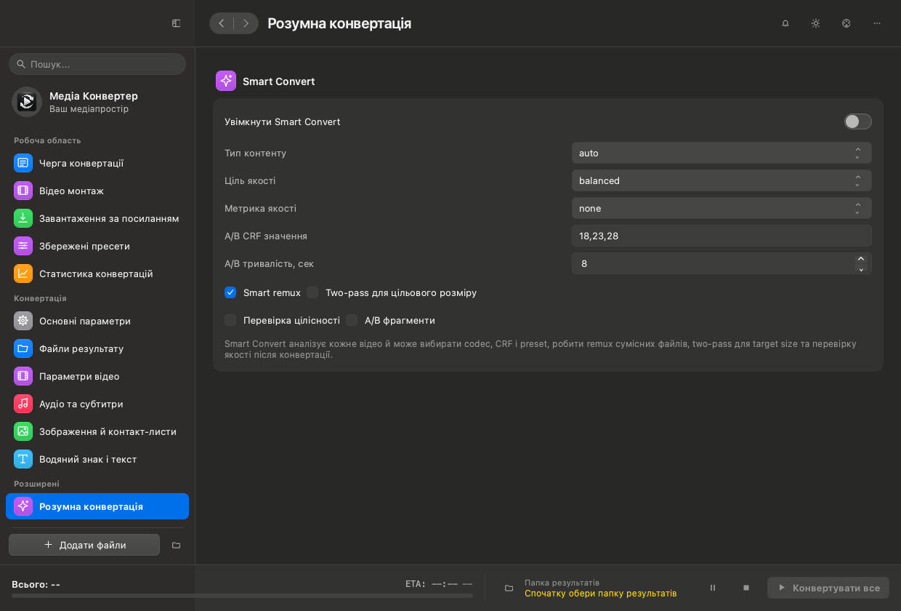
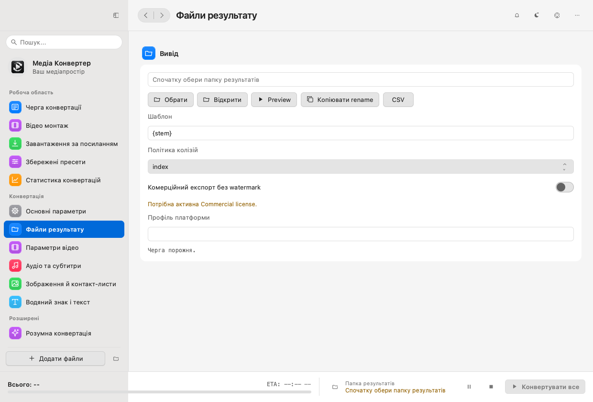
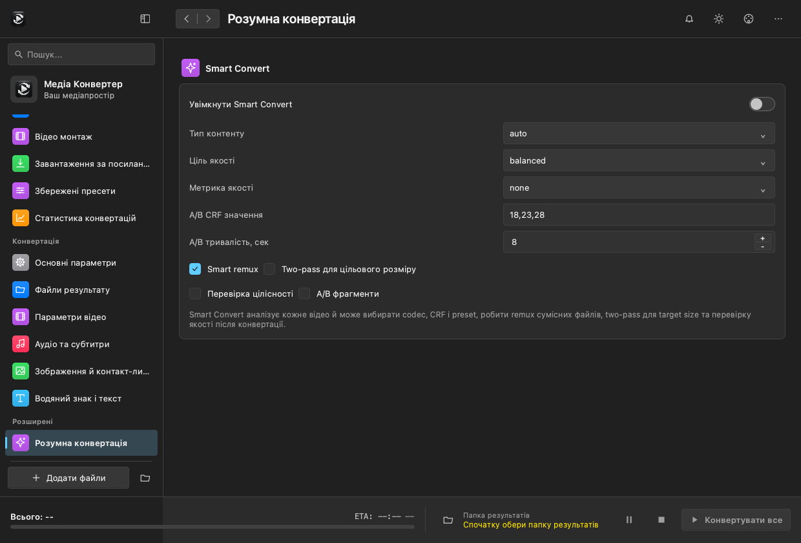
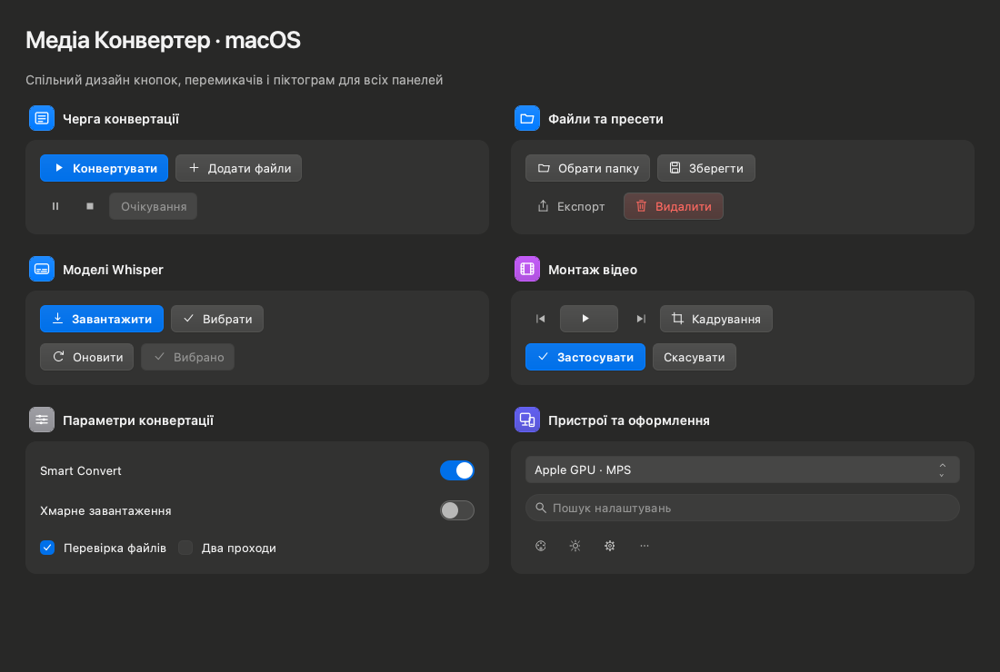
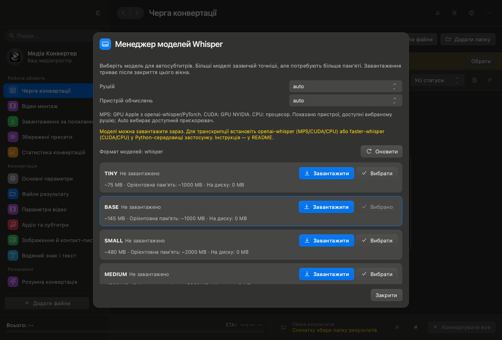

# Platform design

The application detects macOS or Windows through `sys.platform`. The same conversion controls, shortcuts, and saved settings work with either appearance.

## macOS

The layout follows the supplied System Settings reference: a warm gray sidebar, blue selected section, colored vector icons, individual settings pages, rounded groups, and compact buttons. The toolbar uses Qt 6.9's expanded client area while retaining the native window controls. SF system typography comes from Qt's system font. File dialogs use the system dialog implementation when available.

## Windows

Windows receives Segoe UI typography, flatter surfaces, smaller corner radii, taller controls, and an accent marker in the sidebar. Its standard window frame retains minimize/maximize, resizing, and system window positioning. Linux uses the same neutral control geometry and the system font.

## Buttons across panels

The designs below are rendered from the actual reusable QML controls. Icons are drawn locally; buttons need no bitmap assets or external icon downloads. Primary, secondary, destructive, quiet, disabled, and keyboard-focus states share the selected theme. Navigation, conversion, file management, Whisper, and montage use this component family.

## Behavior and customization

- Back/forward navigation preserves entered settings and discards the forward history when a new page is opened.
- The sidebar scrolls the selected section into view. Its search opens settings and existing application search results.
- Independent button groups wrap in narrow windows. Text scaling and density preferences remain available in Appearance.
- Dark and Light use platform defaults. Custom colors, named themes, theme import/export, and high contrast remain supported.
- `Ctrl+Alt+0` restores the default dark colors for the current platform.

## Validation

Automated coverage includes host detection, theme color persistence/contrast, each settings page, history, language menu population, switch mouse/keyboard/disabled behavior, queue interactions, and Whisper selection. Visual checks include dark/light, a 760 px window, 150% text scale, Whisper, and montage. The app was also opened with the macOS Cocoa renderer.

These previews show the client area. Native title-bar controls are supplied by the operating system and are absent from the exported QML images. The Windows preview was rendered using the Windows palette and geometry on macOS; a Windows desktop smoke test remains necessary for native frame/dialog behavior.
